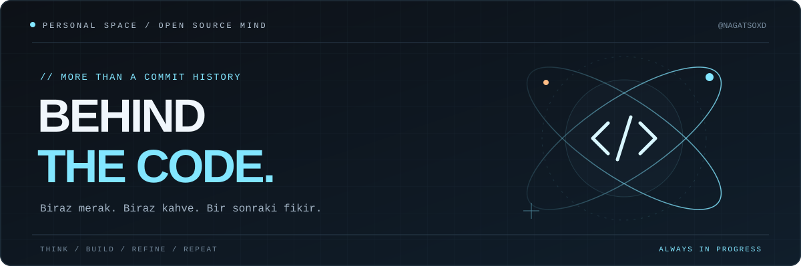
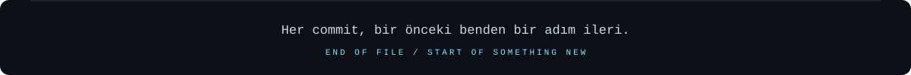

  

<h1 align="center">Selam, ben NAGATSO 👋</h1>

  <samp>Fikirleri kurcalıyorum. Bir şeyler üretiyorum. Her seferinde biraz daha öğreniyorum.</samp>

  
  
  

 

### `01` / Ekranın diğer tarafı

Benim için burası yalnızca kodların durduğu bir yer değil; fikirlerin ilk hâllerinin, küçük denemelerin ve zamanla gelişen işlerin günlüğü.

Bir şeyi merak ettiğimde nasıl çalıştığını anlamayı, sonra da kendi yorumumu katmayı seviyorum. Bazen küçük bir detayla uğraşıyorum, bazen sıfırdan bir fikir kuruyorum. Ortak nokta aynı: **dün bilmediğim bir şeyi bugün öğrenmek.**

> Kusursuz bir başlangıçtan çok, devam eden bir hikâyeye inanıyorum.

### `02` / Fikirden repoya

| Proje | İçeride ne var? | Bağlantı |
| :--- | :--- | :---: |
| **Discord Takip Sistemi** | Discord aktiviteleri ve web panelini bir araya getiren bir proje. | [↗ İncele](https://github.com/nagatsoxd/discord-takip-sistem) |
| **Valicord** | Valicord sürümleri için yayın deposu. | [↗ İncele](https://github.com/nagatsoxd/Valicord-releases) |

Her repo, bir fikrin bıraktığı iz.

### `03` / Projelerdeki araç kutusu

<!-- Teknolojiler discord-takip-sistem deposunun README'sinden alınmıştır. -->

  
  
  
  
  

### `04` / Bir fikrin varsa

İlginç bir proje, ortak bir merak ya da sadece iyi bir sohbet. Bir mesajla başlayabilir.

<!-- Gerçek bağlantılarını ekle. Kullanmadığın bağlantıları kaldır. -->

<!--  -->
<!--  -->

 

  

