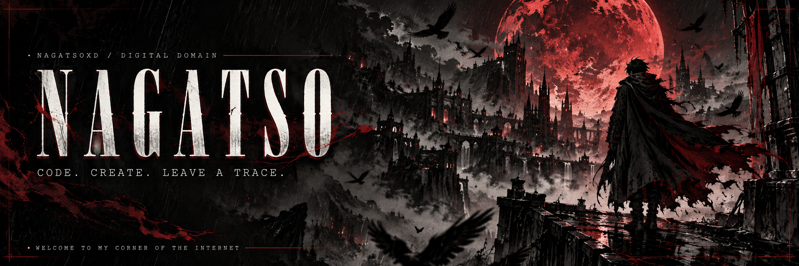
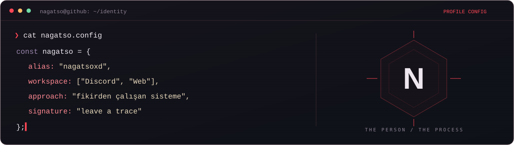
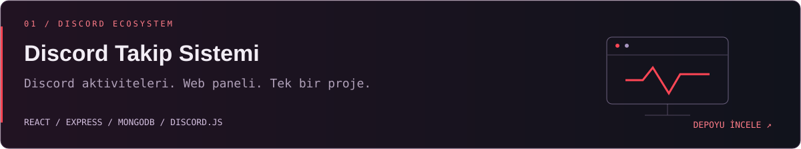
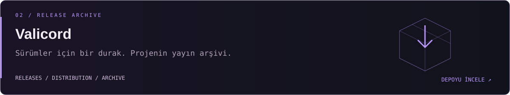

<p align="center"></p>

<p align="center">
  <a href="https://github.com/nagatsoxd"></a>
  
  <a href="https://github.com/nagatsoxd?tab=repositories"></a>
</p>

<p align="center"><samp>Bir fikrin peşinden gidiyorum. Gerisi commit geçmişi.</samp></p>

<p align="center">
<a href="#-karakter-dosyası">HAKKIMDA</a> &nbsp; / &nbsp;
<a href="#-proje-vitrini">PROJELER</a> &nbsp; / &nbsp;
<a href="#-tech-loadout">TEKNOLOJİLER</a> &nbsp; / &nbsp;
<a href="#-bir-sonraki-commit">BAĞLANTILAR</a>
</p>

---

### 🥷 Karakter dosyası



Kodun arkasındaki kişi benim: **NAGATSO**. Bu profil de fikirlerimin, denemelerimin ve bıraktığım küçük izlerin toplandığı yer.

Bir fikrin sadece aklımda kalmasını sevmiyorum. Onu kurcalamak, parçalara ayırmak ve ekranda bir karşılığı olduğunu görmek istiyorum. Discord projeleri, web panelleri ve aralarındaki bağlantılar da bu hikâyenin bir parçası.

> **“Bir şey bırakacaksam, içinde benden bir iz olsun.”**

### ⚡ Proje vitrini

<a href="https://github.com/nagatsoxd/discord-takip-sistem"></a>

<a href="https://github.com/nagatsoxd/Valicord-releases"></a>

<p align="right"><a href="https://github.com/nagatsoxd?tab=repositories"><samp>Tüm depolara git →</samp></a></p>

### 🧩 Tech loadout

<sub>Discord Takip Sistemi projesindeki teknolojiler.</sub>

<p align="center">


</p>

<p align="center"><samp>INTERFACE &nbsp; × &nbsp; BACKEND &nbsp; × &nbsp; DATABASE &nbsp; × &nbsp; DISCORD</samp></p>

<details>
<summary><b>📂 Sahne arkasına bak</b></summary>

<br />

```text
idea/
├── 01-explore     → önce merak et
├── 02-build       → fikre bir şekil ver
├── 03-debug       → düğümleri çöz
├── 04-refine      → detayları toparla
└── 05-repeat      → bir sonraki fikre geç
```

Bir repoyu açmak kolay. İçine kendinden bir şey koymak, işin güzel kısmı.

</details>

### 🩸 Bir sonraki commit

Yeni bir fikir, ortak bir proje veya bir repo turu. Yolun buraya düştüyse, **hoş geldin.**

<p align="center">
<a href="https://github.com/nagatsoxd"></a>
<a href="https://github.com/nagatsoxd?tab=repositories"></a>
<a href="https://github.com/nagatsoxd/Valicord-releases/releases"></a>
</p>

<p align="center"></p>
